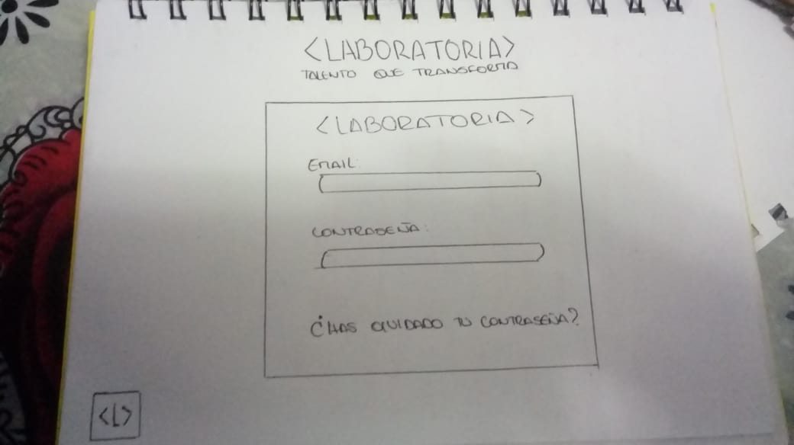
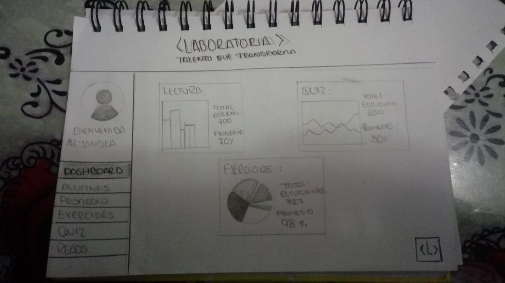
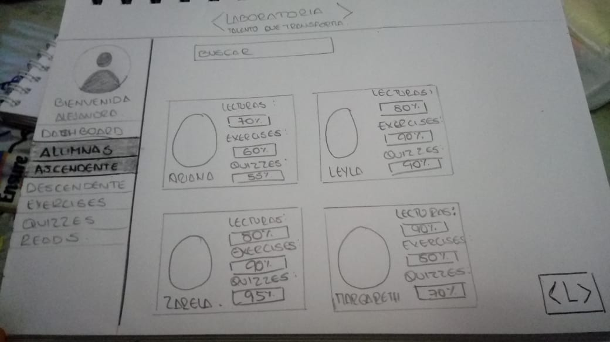
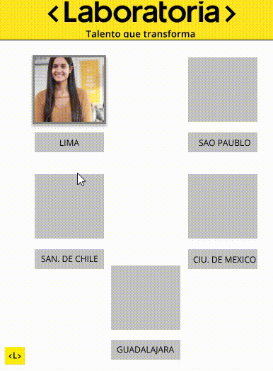
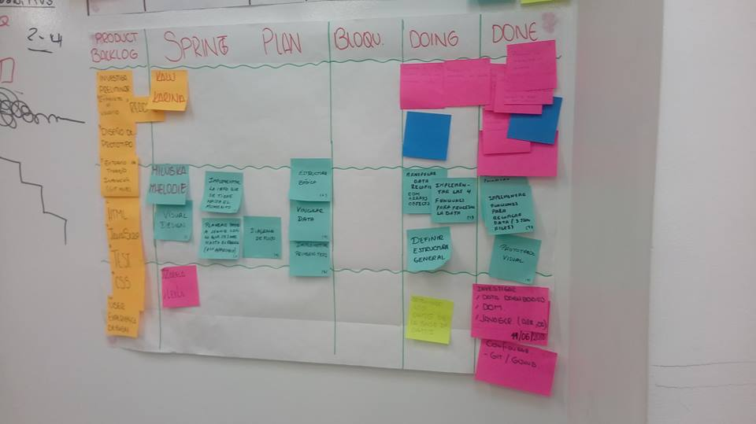
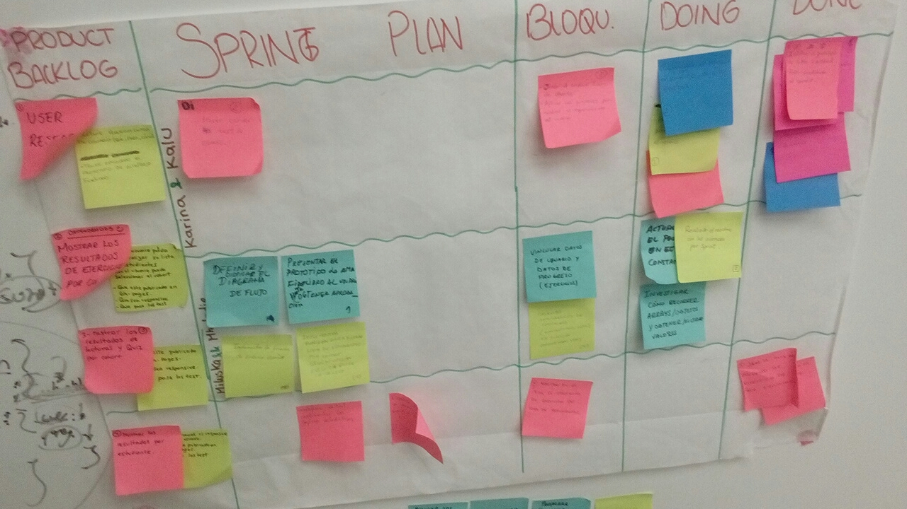

# Data Dashboard
## User Experience Design

#### 1) Definición del producto

* El data Dashboard desarrollado para Laboratoria esta orientada hacia los principales usuarios como:  Training Manager y los Couch, dado que el principal objetivo es visualizar el proceso de aprendizaje de cada estudiante que conforma el Bootcamp. 

Se pudo realizar una entrevista directa al usuario en donde se determino los requerimientos nimimos viables del producto detallados a continuación:

* El usuario desea visualizar graficamente el promedio general de lecturas, ejercicios y examenes  de todas las estudiantes del Bootcamp.

* El usuario revisa la Data cada fin de proyecto, dado que se puede obtener con certeza el avance de cada estudiante con respecto al LMS.

El Data Dashboard desarrollado permite la representación gráfica de los principales indicadores que intervienen en la consecución de los objetivos del Bootcamp , y que está orientada a la toma de decisiones para optimizar la estrategia de autoaprendizaje.

#### 2) Sketch de la solución (prototipo de baja fidelidad)

* Para iniciar con el desarrollo de este proyecto descidimos realizar preguntas a nuestra usuario , y para ello lo desarrollamos en la conferencia que dio nuestra TNMg en las isntalaciones de laboratoria .

* Por ello tomamos las sus respuestas ; en cuanto a lo que espera visualizar en el Proyecto , como primeros indicadores para prototipar el steck de baja fidelidad.

 
 
 

#### 3) Diseño de la Interfaz de Usuario (prototipo de alta fidelidad)

* Con esto dimos inicio a nuestro diseño de interfaz , el cual desarrollariamos  si tuvieramos el tiempo indicado para realizarlo. 
Para ello hicimos huso de la herramienta **FIGMA** : Se trata de una conocida aplicación de diseño de interfaces que permite la colaboración en tiempo real entre varias personas, lo que ayuda a que varios usuarios trabajen en el diseño de una nueva app, por ejemplo, de forma remota y simultánea, comunicándose entre ellos y avanzando en el resultado.
#### 1.3) Diseño de la Interfaz de Usuario (prototipo de alta fidelidad)

 [Figma](https://www.figma.com/file/Xfx8PbNcuM1Su99kQtcTSwOB/DATADASHBORA)
 
 

## Implementación de la Interfaz de Usuario (HTML/CSS/JS)
#### 1) String Planing.

#### 2) String Planing.

#### 3) Definimos los Milesstons.

## COLABORADORXS :

1. Zarela Zanabria
2. Leyla Ticze Huaman

## Detalles de Implementación

- Javascript ES6
- HTML5
- CSS3
- Figma
- Web server for chrome

